# Approachable-Workflows Visual Patterns

**Mermaid diagrams showing common workflow patterns**

Use these visual patterns as templates for your own workflows.

## Dynamic Diagram Generation

**You don't have to draw these yourself!** Both integration modes can generate diagrams for you:

### During Workflow Design
Ask the agent to visualize your workflow:
```
"Generate a workflow diagram for this workflow"
"Show me a Mermaid chart of the flow"
"Create a visual representation of this workflow"
```

Works in both:
- **Runtime Skill mode**: `workflow-runtime` generates diagrams automatically
- **Knowledge Source mode**: Any agent with `spec-for-ai.md` can create diagrams

### During Workflow Execution
The runtime automatically generates an **execution diagram** showing:
- ✅ Activities that succeeded (green)
- ❌ Activities that failed (red)
- ⚠️ Activities that were unclear (yellow)
- 🔵 Final outcome
- Actual path taken through the workflow

**The execution diagram is saved as part of the audit trail** for governance and review.

### Example Request
```
"Run this workflow and show me the execution diagram"
"Execute the workflow and include a Mermaid chart in the report"
```

The patterns below serve as **templates and reference examples** — use them to understand common flows, then let the agent generate diagrams for your specific workflows.

---

## Pattern 1: Simple Linear Flow (Simple)

**Use for**: Straightforward processes with no branching

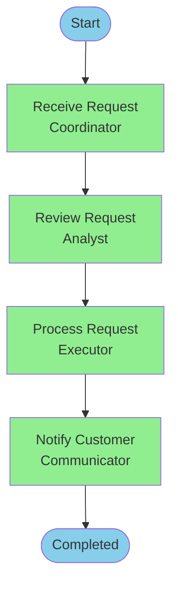

**Workflow:**
```
Workflow: Simple Request Processing
Goal: Process customer requests

Receive Request → Review Request → Process Request → Notify Customer → Completed
```

---

## Pattern 2: Research → Analyze → Verify → Approve → Execute (Standard)

**Use for**: Decisions requiring evidence, analysis, and authorization

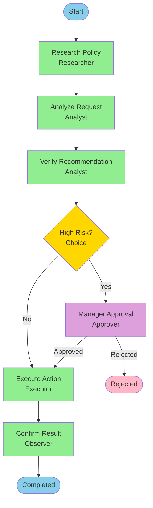

**Key Activities:**
- **Research** (Researcher): Gather evidence with sources
- **Analyze** (Analyst): Form recommendation
- **Verify** (Analyst): Check quality
- **Approve** (Approver): Authorize high-risk actions
- **Execute** (Executor): Perform action
- **Confirm** (Observer): Verify external result

---

## Pattern 3: Choice with Multiple Paths (Standard)

**Use for**: Routing based on conditions

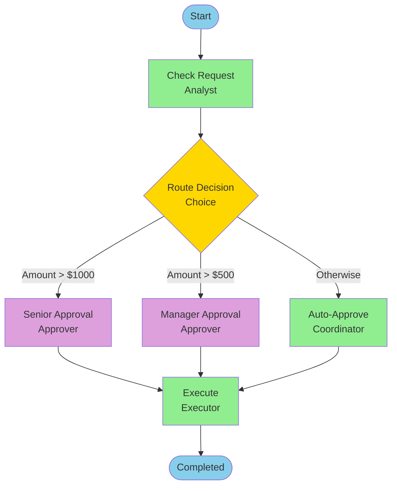

**Workflow:**
```
Activity: Route Decision
  Kind: Choice
  Conditions:
    1. If amount > $1000 → Senior Approval
    2. If amount > $500 → Manager Approval
    3. Otherwise → Auto-Approve
```

---

## Pattern 4: Retry with Backoff (Standard)

**Use for**: External systems that may be temporarily unavailable

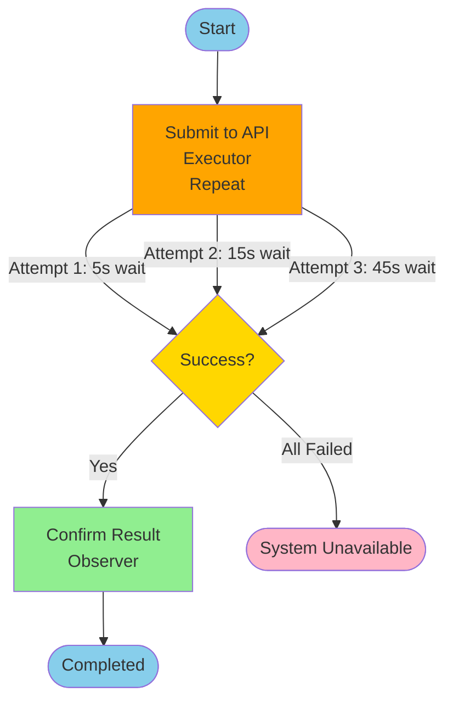

**Workflow:**
```
Activity: Submit to API
  Kind: Repeat
  Role: Executor
  Repeat Until: System responds successfully
  Maximum Attempts: 3
  Wait Between Attempts: 5s, 15s, 45s
  
  If Successful: Confirm Result
  If All Attempts Fail: System Unavailable
```

---

## Pattern 5: Parallel Execution (Standard)

**Use for**: Independent tasks that can run concurrently

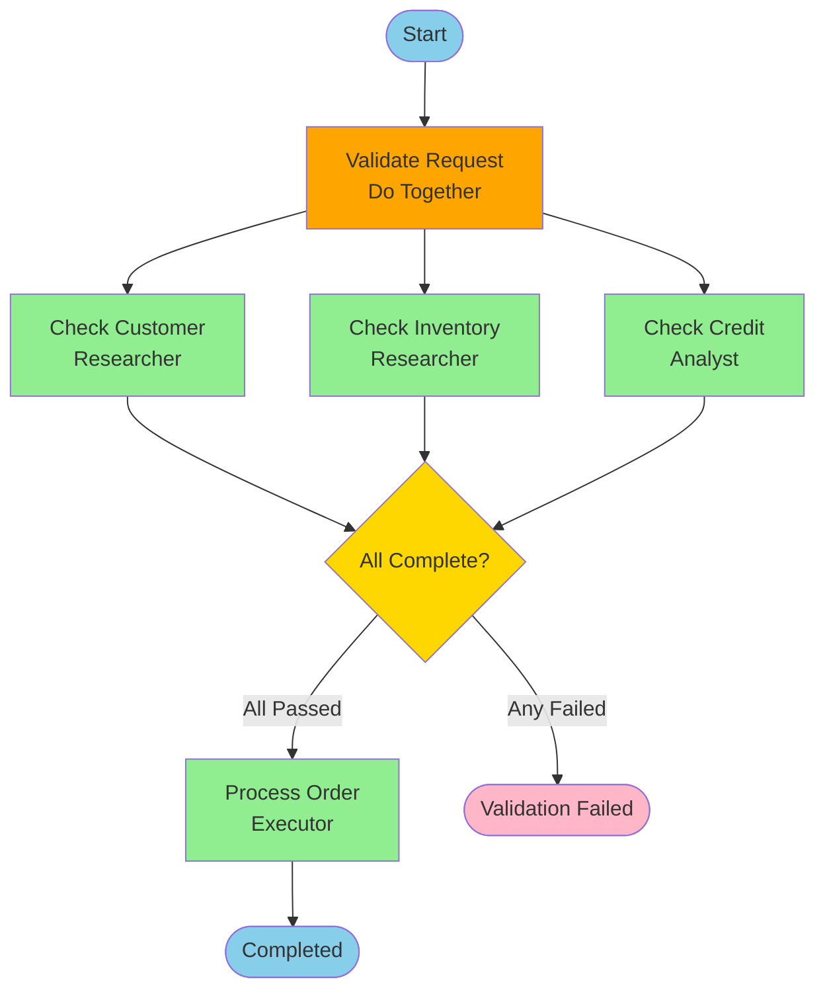

**Workflow:**
```
Activity: Validate Request
  Kind: Do Together
  Do These Activities Together:
    - Check Customer Identity
    - Check Inventory Availability
    - Check Credit Status
  
  Wait For: All
  Time Limit: 30 seconds
  
  When All Complete:
    - If all passed → Process Order
    - If any failed → Validation Failed
    - If timeout → Escalate
```

---

## Pattern 6: Wait for External Event (Standard)

**Use for**: Workflows that pause for human input or external triggers

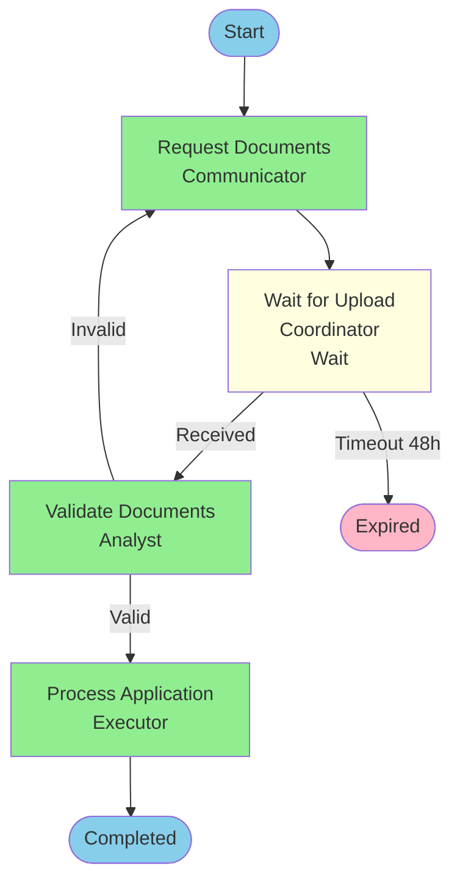

**Workflow:**
```
Activity: Wait for Upload
  Kind: Wait
  Role: Coordinator
  Do: Wait for customer to upload documents
  Time Limit: 48 hours
  
  Next:
    - Documents received → Validate Documents
    - Timeout → Expired
```

---

## Pattern 7: With Failure Paths (Standard)

**Use for**: Production workflows needing robust error handling

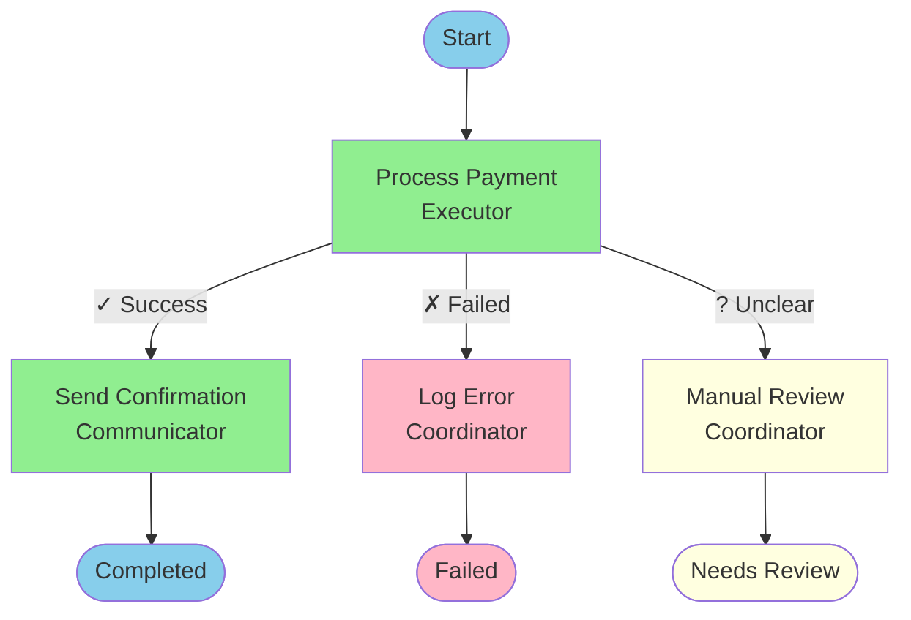

**Workflow:**
```
Activity: Process Payment
  Role: Executor
  Do: Submit payment to external system
  Verify: System confirms transaction
  
  If Failed: Log Error → Failed
  If Unclear: Manual Review → Needs Review
  Next: Send Confirmation
```

---

## Pattern 8: Repeat Over Collection (Standard)

**Use for**: Processing multiple items (documents, requests, line items)

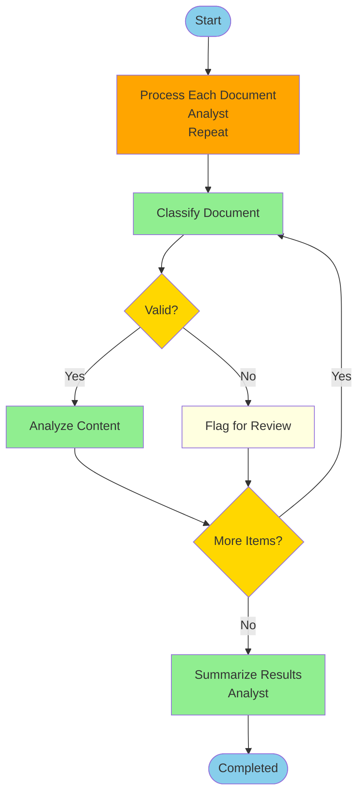

**Workflow:**
```
Activity: Process Each Document
  Kind: Repeat
  Role: Analyst
  Repeat Over: Each document in the upload
  Maximum: 20 documents
  
  For Each Item:
    1. Classify document type
    2. If valid: Analyze content
    3. If invalid: Flag for manual review
  
  When Complete: Summarize Results
```

---

## Pattern 9: Sub-Workflow (Standard)

**Use for**: Reusable workflows called from other workflows

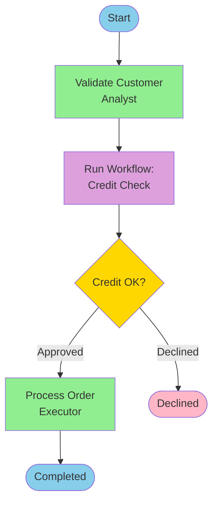

**Workflow:**
```
Activity: Run Credit Check
  Kind: Run Workflow
  Workflow: Standard Credit Check
  Provide:
    - Customer ID
    - Requested Amount
  Receive:
    - Credit Decision
    - Credit Score
  
  Next: Process Order
```

---

## Pattern 10: Full Extended with State & Events

**Use for**: Complex, mission-critical workflows with state tracking

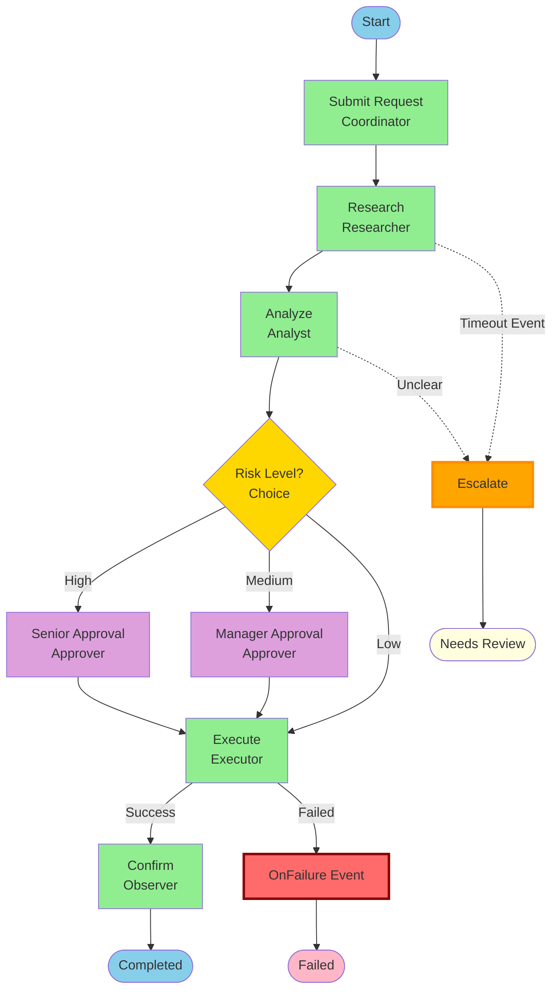

**Workflow with State & Events:**
```
Workflow: Complex Request Processing
Version: 2.0

Business State:
  - Submitted
  - Under Review
  - Awaiting Approval
  - Approved
  - Executing
  - Completed
  - Failed
  - Escalated

Events:
  On Failure:
    - Log to monitoring system
    - Notify support team
    - Set Business State to Failed
    - Continue to Failed outcome
  
  On Timeout:
    - Capture partial results
    - Set Business State to Escalated
    - Continue to Escalation

Activities:
  [Activities with State Changes...]
  
  State Changes:
    - Submit Request → Set Business State to Submitted
    - Research → Set Business State to Under Review
    - Approval → Set Business State to Awaiting Approval
    - Execute → Set Business State to Executing
```

---

## Legend

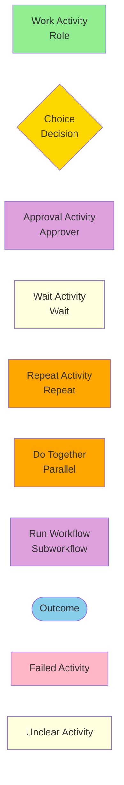

**Colors:**
- 🟢 **Green** (#90EE90): Successful Work activities
- 🟡 **Yellow** (#FFD700): Choice/Decision points
- 🟣 **Purple** (#DDA0DD): Approval activities
- 🟡 **Light Yellow** (#FFFFE0): Wait activities or Unclear states
- 🟠 **Orange** (#FFA500): Repeat or Do Together activities
- 🔵 **Blue** (#87CEEB): Outcomes (start/end)
- 🔴 **Red** (#FFB6C6): Failed states

---

## How to Use These Patterns

### Option 1: Manual Design
1. **Start with the pattern** that matches your workflow type
2. **Copy the Mermaid diagram** to visualize your flow
3. **Adapt the activities** to your specific needs
4. **Add Verify conditions** where quality matters
5. **Define If Failed paths** for robust error handling
6. **Add State tracking** (Extended) if your workflow is long-running

### Option 2: Agent-Generated (Recommended)
1. **Write your workflow** in plain English
2. **Ask the agent** to generate a diagram:
   - "Show me a workflow diagram"
   - "Generate a Mermaid chart for this workflow"
3. **Review and iterate** on the visualization
4. **Execute** and get an audit-ready execution diagram automatically

## Execution Diagrams in Audit Reports

When you execute a workflow, the runtime generates a **color-coded execution diagram** showing:

- **Actual path taken** through your workflow
- **Success/failure status** of each activity
- **Duration** and timestamps
- **Decision points** and which conditions matched
- **Final outcome** reached

**This diagram is automatically included in:**
- HTML execution reports
- Evidence packages
- Audit trails
- Workflow recommendations

**Example execution output:**
```markdown
# Workflow Execution: Customer Refund Review

## Mermaid Chart
[Color-coded diagram showing green successes, red failures, actual path]

## Evidence Package
[All captured evidence by activity and role]

## Recommendations
[Suggestions for workflow improvement]
```

The execution diagram becomes a permanent audit record, making it easy to:
- Review what actually happened
- Identify bottlenecks
- Debug failures
- Demonstrate compliance
- Train new team members

---

## Need More Examples?

- **Real workflows**: [examples.md](../../examples/examples.md)
- **Pattern library**: [pattern-examples.md](../../examples/pattern-examples.md)
- **Production example**: [Legal Discovery Review](../../examples/legal-review-analysis/)
- **Step-by-Step Guide**: [step-by-step.md](../tutorials/step-by-step.md)
